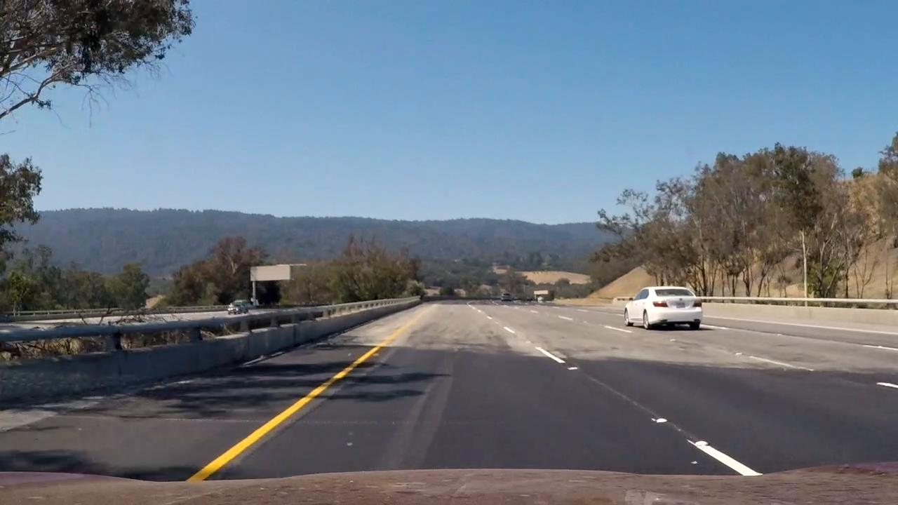
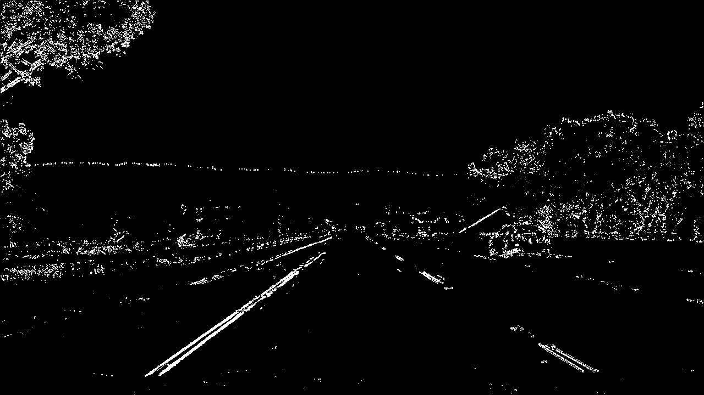
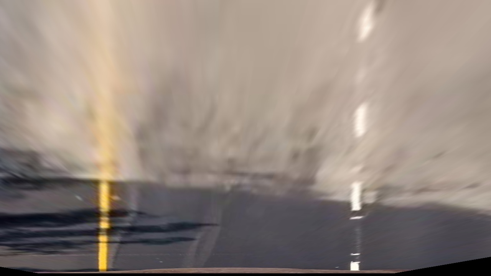
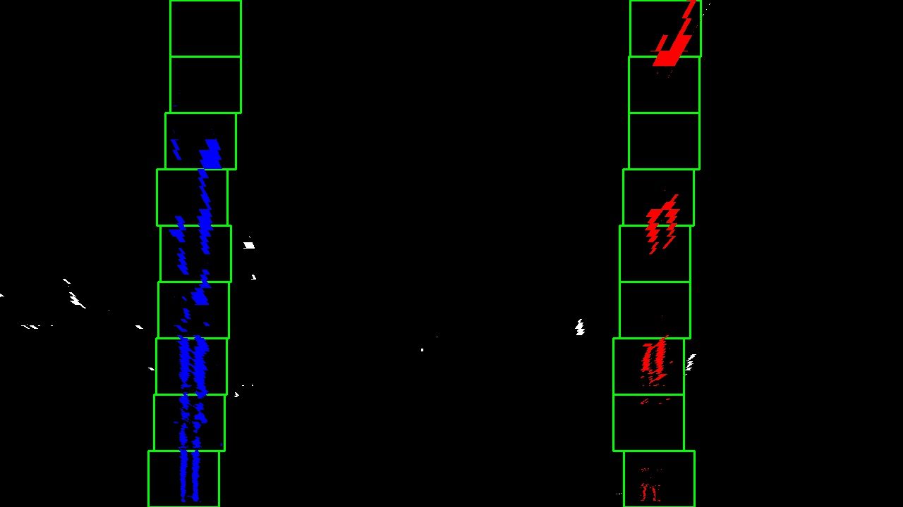
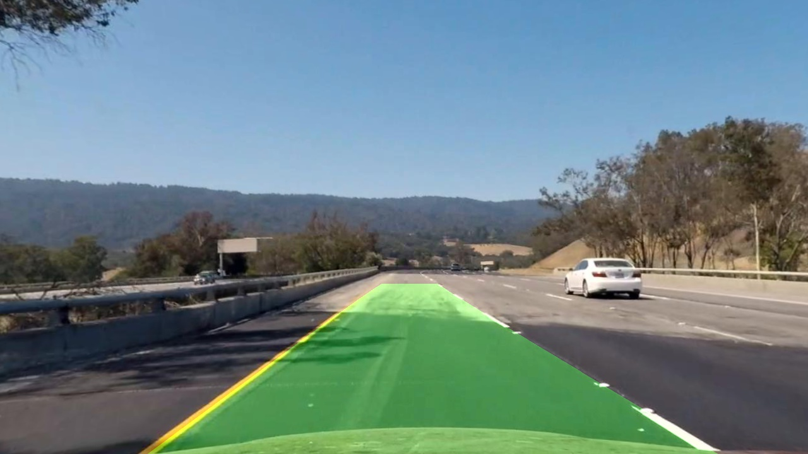

**Advanced Lane Finding Project**

The goals / steps of this project are the following:

* Compute the camera calibration matrix and distortion coefficients given a set of chessboard images.
* Apply a distortion correction to raw images.
* Use color transforms, gradients, etc., to create a thresholded binary image.
* Apply a perspective transform to rectify binary image ("birds-eye view").
* Detect lane pixels and fit to find the lane boundary.
* Determine the curvature of the lane and vehicle position with respect to center.
* Warp the detected lane boundaries back onto the original image.
* Output visual display of the lane boundaries and numerical estimation of lane curvature and vehicle position.

## [Rubric](https://review.udacity.com/#!/rubrics/571/view) Points

### Here I will consider the rubric points individually and describe how I addressed each point in my implementation.  

---

### Writeup / README

### Camera Calibration

#### 1. Computing the camera matrix and distortion coefficients.

The code for this step is contained in the 2th code cell of the IPython notebook located in "./Advanced_Lane_Finding_Project.ipynb"

I first looked for object points and image points which I can use for calibration. I do this in the find_points_for_calibration() function.
If the object and image points are found I use them to calibrate the camera. I do this in the calibrate_camera() function which uses the opencv `cv2.calibrateCamera` function

Using the return values from the calibrate_camera() function, the `cv2.undistort` function gives me the following output:

`Original Image` 

`Calibrated and Undistorted` 

### Pipeline (single images)

#### 1. Provide an example of a distortion-corrected image.

The code for this step is contained in the 4th code cell of the IPython notebook located in "./Advanced_Lane_Finding_Project.ipynb"

The first step in the image processing pipeline to undistort the image. The above explanation shows how I implemented this.
Here is an example:

`Original Image` 

`Calibrated and Undistorted` 

#### 2. Using color transforms, gradients and magintudes to create a thresholded binary image.

The code for this step is contained in the 5th code cell of the IPython notebook located in "./Advanced_Lane_Finding_Project.ipynb"
Examples are in the 6th till 15th code cells

To make it easier to identify lane lines I used a combination of color and gradient thresholding to generate a binary image.
I applied the following thresholds:

* Absolute sobel threshold in x and y direction (these give back lines oriented in the x or y direction)
* Magnitude threshold with sobel (this returns lines where the gradient is either small or big, depending on the settings)
* Direction threshold with sobel (this returns line at a certain angle form the x axis, depending on the settings)
* I used the L and S channels from the HLS color space to try filter out the yellow and white lane lines

To get good result I combined the different threshold. The binary operations that gave me the best results are:

`((gradx == 1) & (grady == 1)) | ((color_s == 1) | (color_l == 1)) & ((mag_binary == 1) & (dir_binary == 1))`

Here's an example of my output for this step.

`Original Image` 

`Combined thresholds binary image` 

#### 3. Perspective transform

The code for this step is contained in the 16th code cell of the IPython notebook located in "./Advanced_Lane_Finding_Project.ipynb"

I have implemented a function get_tranform_matrix() which one returns a tranformation matrix.
I have also written a function called warp_perspective() which takes as input an image and a tranformation matrix.
The source and destination points are hardcoded:

This resulted in the following source and destination points:

| Source        | Destination   | 
|:-------------:|:-------------:| 
| 685, 450      | 900, 0        | 
| 1090, 710     | 900, 710      |
| 220, 710      | 250, 710      |
| 595, 450      | 250, 0        |

The following images show the output of the perspective tranform:

`Original Image` 

`Warped Image` 

#### 4. identifying lane-line pixels and fit their positions with a polynomial?

The code for this step is contained in the 16th till 23th code cells of the IPython notebook located in "./Advanced_Lane_Finding_Project.ipynb"

To identify lane pixels I took the following steps:

* Use combined thresholds and warp image
* remove a small triangle of the image at the bottom, inside the two lane lines. This removes some dirt or non lane lines from the image
* detect lane lines with a histogram
* fit polynomial with the provided function by Udacity (I did set the margin to 50px, which improved my results)
* draw the lane line on the image and warp the image back to its original shape

`Original Image` 

`Polynomial` 

#### 5. Calculating the radius of curvature of the lane and the position of the vehicle with respect to center.

The code for this step is contained in the 24th and 25th code cells of the IPython notebook located in "./Advanced_Lane_Finding_Project.ipynb"

The curvature is calculated with the provided code by Udacity.
The offset of the car is calculated by taking the cars current position and extracting the lane center position. This should than be multiplied by (3.7/100) to get the real distance in meters.

#### 6. Example image of result plotted back down onto the road such that the lane area is identified clearly.

The code for this step is contained in the 26th code cell of the IPython notebook located in "./Advanced_Lane_Finding_Project.ipynb"

I implemented a function that processes test images. It is very similar to the final pipeline but does not have state.

`Calibrated and Undistorted` 

`Calibrated and Undistorted` 

---

### Pipeline (video)

The code for this step is contained in the 28th code cell of the IPython notebook located in "./Advanced_Lane_Finding_Project.ipynb"

#### 1. Provide a link to your final video output.  Your pipeline should perform reasonably well on the entire project video (wobbly lines are ok but no catastrophic failures that would cause the car to drive off the road!).

Here's a [link to my video result](https://youtu.be/S5qHgaEEDbM)

---

### Discussion

#### 1. Discussion of problems / issues I faced in my implementation of this project.

There is a lot I think could be improved in my pipeline. It it's current form it has problems with detecting lane lines when bright sun or dark shaddows are cast over the lane lines.
Also when there are sharp bends in the road the pipeline fails.

I found detecting lane lines in different lighting conditions very challenging. In particlar dark lines, that are often part of the asphalt, turn up as lines in the binary image.
To improve my pipeline for this issue I would like to experiment with the following:

* Trying more different values for the gradient, magnitude and color thresholds
* See if I can find dark lines, with thresholding, and filter those out (instead of searching for light lane lines)
* Use Ransac for finding the proper lane lines
* Calculate the space between te current lane lines. If the space does not seem right, try finding a better match in the frame.
* Try using different thresholds based on the brightness of the image. Using the same thresholds does not seem to work on every frame
